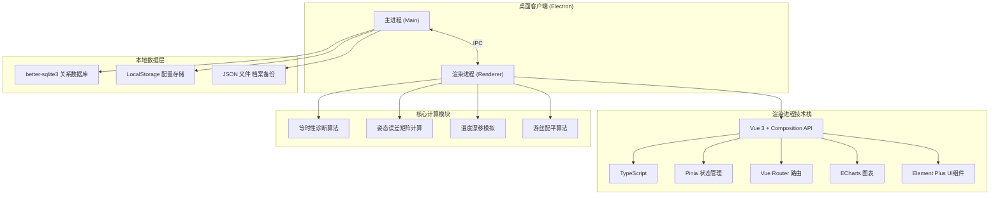
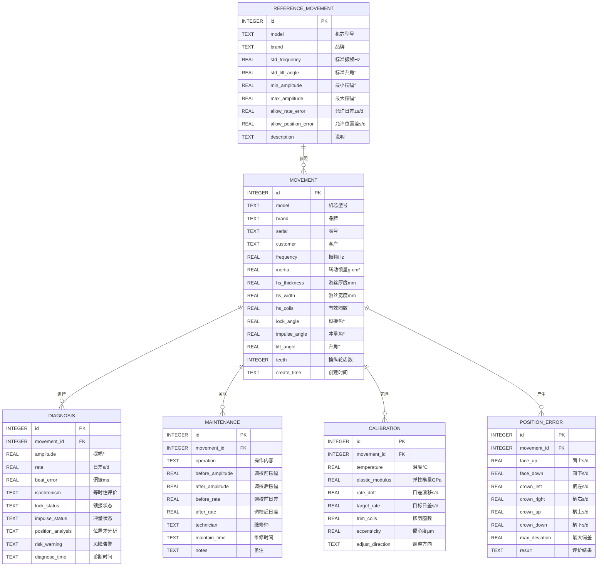

## 1. 架构设计



## 2. 技术选型说明

- **前端框架**：Electron 30 + Vue 3.4 + TypeScript 5.4
  - Electron提供跨平台桌面客户端能力
  - Vue 3 Composition API提供灵活的组件组织方式
  - TypeScript确保复杂计算逻辑的类型安全
  
- **初始化工具**：electron-vite-vue 脚手架
  - 快速搭建Electron + Vue + TypeScript开发环境
  - 热更新支持，提升开发效率
  
- **UI组件库**：Element Plus 2.7
  - 丰富的表单、表格、对话框组件
  - 支持深色主题定制
  
- **图表库**：ECharts 5.5
  - 仪表盘、雷达图、热力图、折线图、散点图
  - 高性能大数据量渲染
  
- **状态管理**：Pinia 2.1
  - 轻量级状态管理，支持TypeScript
  - 跨组件共享机芯参数、诊断结果
  
- **本地数据库**：better-sqlite3 11.3
  - 嵌入式关系数据库，无需单独部署
  - 高性能同步API，适合单机桌面应用
  - 存储维修档案、参照库数据
  
- **数据持久化**：
  - better-sqlite3存储结构化业务数据
  - LocalStorage存储用户配置和界面状态
  - JSON文件支持数据导入导出备份

## 3. 路由定义

| 路由路径 | 页面名称 | 说明 |
|---------|---------|------|
| / | 工作台首页 | 快捷入口、最近维修、告警概览 |
| /movement | 机芯录入页 | 摆轮游丝与擒纵机构参数录入 |
| /diagnosis | 等时诊断页 | 摆幅校验、位置差识别、误差矩阵 |
| /hairspring | 游丝配平页 | 温度模拟、反推修剪量、偏心检测 |
| /archive | 维修档案页 | 校表记录、振幅日差图、风险告警 |
| /reference | 参照库页 | 机芯参数库、故障案例、调校规范 |

## 4. 数据模型

### 4.1 实体关系图



### 4.2 数据库初始化脚本

```sql
-- 机芯信息表
CREATE TABLE IF NOT EXISTS movement (
    id INTEGER PRIMARY KEY AUTOINCREMENT,
    model TEXT NOT NULL,
    brand TEXT,
    serial TEXT UNIQUE,
    customer TEXT,
    frequency REAL,
    inertia REAL,
    hs_thickness REAL,
    hs_width REAL,
    hs_coils REAL,
    lock_angle REAL,
    impulse_angle REAL,
    lift_angle REAL,
    teeth INTEGER,
    create_time DATETIME DEFAULT CURRENT_TIMESTAMP
);

-- 诊断记录表
CREATE TABLE IF NOT EXISTS diagnosis (
    id INTEGER PRIMARY KEY AUTOINCREMENT,
    movement_id INTEGER NOT NULL,
    amplitude REAL,
    rate REAL,
    beat_error REAL,
    isochronism TEXT,
    lock_status TEXT,
    impulse_status TEXT,
    position_analysis TEXT,
    risk_warning TEXT,
    diagnose_time DATETIME DEFAULT CURRENT_TIMESTAMP,
    FOREIGN KEY (movement_id) REFERENCES movement(id)
);

-- 位置误差表
CREATE TABLE IF NOT EXISTS position_error (
    id INTEGER PRIMARY KEY AUTOINCREMENT,
    movement_id INTEGER NOT NULL,
    face_up REAL,
    face_down REAL,
    crown_left REAL,
    crown_right REAL,
    crown_up REAL,
    crown_down REAL,
    max_deviation REAL,
    result TEXT,
    FOREIGN KEY (movement_id) REFERENCES movement(id)
);

-- 维修档案表
CREATE TABLE IF NOT EXISTS maintenance (
    id INTEGER PRIMARY KEY AUTOINCREMENT,
    movement_id INTEGER NOT NULL,
    operation TEXT,
    before_amplitude REAL,
    after_amplitude REAL,
    before_rate REAL,
    after_rate REAL,
    technician TEXT,
    maintain_time DATETIME DEFAULT CURRENT_TIMESTAMP,
    notes TEXT,
    FOREIGN KEY (movement_id) REFERENCES movement(id)
);

-- 调校记录表
CREATE TABLE IF NOT EXISTS calibration (
    id INTEGER PRIMARY KEY AUTOINCREMENT,
    movement_id INTEGER NOT NULL,
    temperature REAL,
    elastic_modulus REAL,
    rate_drift REAL,
    target_rate REAL,
    trim_coils REAL,
    eccentricity REAL,
    adjust_direction TEXT,
    FOREIGN KEY (movement_id) REFERENCES movement(id)
);

-- 机芯参照库表
CREATE TABLE IF NOT EXISTS reference_movement (
    id INTEGER PRIMARY KEY AUTOINCREMENT,
    model TEXT NOT NULL UNIQUE,
    brand TEXT,
    std_frequency REAL,
    std_lift_angle REAL,
    min_amplitude REAL,
    max_amplitude REAL,
    allow_rate_error REAL,
    allow_position_error REAL,
    description TEXT
);

-- 初始化标准机芯数据
INSERT OR IGNORE INTO reference_movement 
(model, brand, std_frequency, std_lift_angle, min_amplitude, max_amplitude, allow_rate_error, allow_position_error, description)
VALUES
('ETA2824-2', 'ETA', 4.0, 50.0, 220.0, 300.0, 6.0, 15.0, '经典自动机芯，大三针'),
('ETA7750', 'ETA', 4.0, 50.0, 220.0, 300.0, 6.0, 15.0, '计时机芯，柱轮结构'),
('2892A2', 'ETA', 4.0, 50.0, 220.0, 300.0, 4.0, 12.0, '超薄自动机芯'),
('3135', 'Rolex', 4.0, 52.0, 240.0, 310.0, 2.0, 8.0, '劳力士自产机芯，蓝游丝'),
('3235', 'Rolex', 4.0, 52.0, 240.0, 310.0, 2.0, 8.0, '新一代劳力士机芯'),
('8500', 'Omega', 3.5, 50.0, 240.0, 310.0, 2.0, 8.0, '欧米茄同轴机芯'),
('B01', 'Breitling', 4.0, 50.0, 240.0, 310.0, 4.0, 10.0, '百年灵自产计时机芯'),
('P.3000', 'Panerai', 2.5, 55.0, 220.0, 290.0, 6.0, 15.0, '沛纳海手动机芯'),
('FP1185', 'Frederic Piguet', 3.0, 50.0, 240.0, 310.0, 4.0, 10.0, '高端计时机芯'),
('L888', 'Longines', 3.5, 50.0, 220.0, 300.0, 5.0, 12.0, '浪琴专属机芯');
```

## 5. 核心计算算法定义

### 5.1 等时性校验算法

```typescript
// 摆幅-日差等时性校验
function checkIsochronism(amplitude: number, rate: number, reference: Reference): {
    isInRange: boolean;
    deviation: number;
    level: 'excellent' | 'good' | 'normal' | 'poor';
} {
    // 理想等时曲线：摆幅在220°-280°区间日差变化应<3s/d
    const idealRate = this.calculateIdealRate(amplitude, reference);
    const deviation = Math.abs(rate - idealRate);
    
    if (deviation < 2) return { isInRange: true, deviation, level: 'excellent' };
    if (deviation < 4) return { isInRange: true, deviation, level: 'good' };
    if (deviation < 6) return { isInRange: true, deviation, level: 'normal' };
    return { isInRange: false, deviation, level: 'poor' };
}
```

### 5.2 姿态误差矩阵算法

```typescript
// 六方位走时偏差矩阵计算
function calculatePositionMatrix(errors: PositionErrors): {
    matrix: number[][];
    maxDeviation: number;
    average: number;
    isPass: boolean;
} {
    const { faceUp, faceDown, crownLeft, crownRight, crownUp, crownDown } = errors;
    
    // 3×2矩阵：[面上, 面下; 柄左, 柄右; 柄上, 柄下]
    const matrix = [
        [faceUp, faceDown],
        [crownLeft, crownRight],
        [crownUp, crownDown]
    ];
    
    const allValues = [faceUp, faceDown, crownLeft, crownRight, crownUp, crownDown];
    const maxDeviation = Math.max(...allValues) - Math.min(...allValues);
    const average = allValues.reduce((a, b) => a + b, 0) / 6;
    const isPass = maxDeviation <= 15; // 位置差≤15s/d为合格
    
    return { matrix, maxDeviation, average, isPass };
}
```

### 5.3 温度漂移模拟算法

```typescript
// 温度-弹性模量-日差关系模拟
function simulateTemperatureDrift(
    baseModulus: number,
    frequency: number,
    tempRange: [number, number]
): Array<{temp: number, modulus: number, rate: number}> {
    const results = [];
    // 游丝弹性模量温度系数约为-0.02%/°C
    const tempCoefficient = -0.0002; 
    
    for (let t = tempRange[0]; t <= tempRange[1]; t += 5) {
        const modulus = baseModulus * (1 + tempCoefficient * (t - 20));
        // 频率与弹性模量平方根成正比
        const newFrequency = frequency * Math.sqrt(modulus / baseModulus);
        // 日差 = (新频率 - 标准频率) / 标准频率 × 86400
        const rate = (newFrequency - frequency) / frequency * 86400;
        results.push({ temp: t, modulus, rate });
    }
    
    return results;
}
```

### 5.4 游丝修剪量反推算法

```typescript
// 根据目标日差反推游丝修剪量
function calculateTrimCoils(
    currentRate: number,
    targetRate: number,
    currentCoils: number,
    frequency: number
): {
    trimCoils: number;
    direction: 'shorten' | 'lengthen';
    precision: string;
} {
    // 日差与游丝长度近似成正比
    // 相对误差 = (目标日差 - 当前日差) / 86400
    const relativeError = (targetRate - currentRate) / 86400;
    // 游丝圈数变化 ≈ 2 × 相对误差 × 当前圈数 (频率与长度平方根成反比)
    const deltaCoils = 2 * relativeError * currentCoils;
    
    const trimCoils = Math.abs(deltaCoils);
    const direction = deltaCoils > 0 ? 'lengthen' : 'shorten';
    const precision = this.formatPrecision(trimCoils);
    
    return { trimCoils, direction, precision };
}
```

### 5.5 脱跳风险检测算法

```typescript
// 擒纵余隙脱跳检测
function checkEscapementClearance(
    lockAngle: number,
    impulseAngle: number,
    teeth: number,
    measuredClearance: number
): {
    hasRisk: boolean;
    theoreticalClearance: number;
    tolerance: number;
    suggestion: string;
} {
    // 理论余隙 = 360° / 齿数 / 2 - 锁接角 - 冲量角
    const theoreticalClearance = (360 / teeth / 2) - lockAngle - impulseAngle;
    const tolerance = theoreticalClearance * 0.3; // 30%公差
    const hasRisk = measuredClearance > theoreticalClearance + tolerance;
    
    let suggestion = '';
    if (hasRisk) {
        suggestion = '余隙过大，存在脱跳风险，建议检查叉头钉位置或更换擒纵叉';
    } else if (measuredClearance < theoreticalClearance - tolerance) {
        suggestion = '余隙过小，可能导致传动不畅，建议检查叉瓦深度';
    } else {
        suggestion = '余隙正常';
    }
    
    return { hasRisk, theoreticalClearance, tolerance, suggestion };
}
```

## 6. 项目目录结构

```
watch-adjustment-system/
├── .trae/
│   └── documents/          # 项目文档
│       ├── PRD.md
│       └── ARCH.md
├── src/
│   ├── main/               # Electron主进程
│   │   ├── index.ts
│   │   ├── database.ts     # SQLite数据库操作
│   │   └── ipc.ts          # IPC通信处理
│   ├── renderer/           # Vue渲染进程
│   │   ├── assets/         # 静态资源
│   │   ├── components/     # 通用组件
│   │   │   ├── GaugeMeter.vue    # 仪表盘
│   │   │   ├── PositionRadar.vue # 位置雷达图
│   │   │   └── ErrorMatrix.vue   # 误差矩阵
│   │   ├── views/          # 页面组件
│   │   │   ├── Dashboard.vue      # 工作台
│   │   │   ├── MovementInput.vue  # 机芯录入
│   │   │   ├── Diagnosis.vue      # 等时诊断
│   │   │   ├── Hairspring.vue     # 游丝配平
│   │   │   ├── Archive.vue        # 维修档案
│   │   │   └── Reference.vue      # 参照库
│   │   ├── stores/         # Pinia状态
│   │   │   ├── movement.ts
│   │   │   └── diagnosis.ts
│   │   ├── utils/          # 工具函数
│   │   │   ├── calculator.ts      # 核心计算算法
│   │   │   └── validator.ts       # 数据校验
│   │   ├── types/          # TypeScript类型定义
│   │   │   └── index.ts
│   │   ├── router/         # 路由配置
│   │   └── App.vue
│   └── shared/             # 主进程与渲染进程共享类型
├── dist/                   # 构建输出
├── package.json
├── tsconfig.json
├── vite.config.ts
└── electron.vite.config.ts
```
