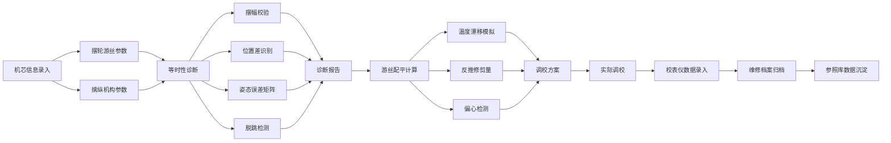

## 1. 产品概述

机械腕表擒纵调校等时性诊断与游丝配平生产力系统，面向专业制表维修师，提供精密的擒纵机构调校诊断、游丝配平计算和维修档案管理。系统通过量化分析摆轮游丝振动特性、擒纵锁接冲量传递、姿态误差矩阵等核心参数，帮助维修师精准调校腕表走时精度，提升维修效率和质量。

## 2. 核心功能

### 2.1 用户角色
| 角色 | 注册方式 | 核心权限 |
|------|---------|----------|
| 制表维修师 | 本地激活 | 机芯参数录入、等时性诊断、游丝配平计算、维修档案管理、参照库查询 |

### 2.2 功能模块
1. **机芯录入页**：摆轮游丝参数录入、擒纵机构参数录入、基础信息管理
2. **等时诊断页**：摆幅校验、锁接冲量分析、位置差识别、姿态误差矩阵
3. **游丝配平页**：余隙校验、温度漂移模拟、反推修剪量、偏心检测
4. **维修档案页**：校表仪记录、振幅日差图、维修历史、风险告警
5. **参照库页**：机芯标准参数库、故障案例库、调校规范库

### 2.3 页面详情
| 页面名称 | 模块名称 | 功能描述 |
|---------|---------|----------|
| 机芯录入页 | 摆轮游丝参数 | 振频(Hz/A/h)、转动惯量(g·cm²)、游丝厚度、宽度、有效圈数、内外端固定方式 |
| 机芯录入页 | 擒纵机构参数 | 擒纵叉瓦角度（锁接角/冲量角）、叉头钉尺寸、擒纵轮齿数、升角 |
| 机芯录入页 | 基础信息 | 机芯型号、品牌、表号、客户信息、维修日期 |
| 等时诊断页 | 摆幅校验 | 按摆幅（270°/240°/210°/180°）校验擒纵锁接与冲量传递是否落在等时区间 |
| 等时诊断页 | 位置差识别 | 识别游丝偏心与末端曲线不当导致的位置差，超差项标红告警 |
| 等时诊断页 | 姿态误差矩阵 | 计算面上面下三柄（6方位）走时偏差，生成3×2误差矩阵热力图 |
| 等时诊断页 | 脱跳检测 | 校验擒纵叉与擒纵轮的余隙是否过大引起脱跳风险 |
| 游丝配平页 | 温度模拟 | 模拟-10°C~+60°C温度变化下游丝弹性模量漂移对日差的影响曲线 |
| 游丝配平页 | 反推修剪量 | 按目标日差（±0s/d）反推游丝有效圈数的修剪量，精确到1/8圈 |
| 游丝配平页 | 偏心检测 | 检测游丝偏心度，计算需要调整的方向和位移量 |
| 游丝配平页 | 余隙校验 | 测量擒纵叉与擒纵轮的啮合余隙，判断是否在标准范围内 |
| 维修档案页 | 校表仪记录 | 录入/导入校表仪数据，记录每次调校的振幅、日差、偏振参数 |
| 维修档案页 | 振幅日差图 | 可视化展示历史调校数据的振幅-日差趋势散点图 |
| 维修档案页 | 风险告警 | 对摆幅过低（<220°）预示动力不足或油干涩进行风险告警 |
| 维修档案页 | 维修历史 | 按表号查询维修历史，追踪调校效果 |
| 参照库页 | 机芯参数库 | 沉淀不同机芯的标准校表参数（振频、升角、摆幅范围等） |
| 参照库页 | 故障案例库 | 常见故障现象、原因分析、调校方案的知识库 |
| 参照库页 | 调校规范库 | 各品牌机芯的标准调校流程和验收标准 |

## 3. 核心流程

## 4. 界面设计

### 4.1 设计风格
- **主色调**：深邃午夜蓝(#0A1628)作为主背景，搭配精密铜金色(#B8860B)作为强调色，体现高级精密仪器的专业质感
- **辅助色**：银灰色(#C0C0C0)用于边框和分割线，警示红(#DC3545)用于超差标红，合格绿(#28A745)用于正常状态
- **字体**：使用JetBrains Mono作为数据显示字体（等宽精确），Source Han Serif SC作为标题字体（稳重专业）
- **布局**：左侧导航栏 + 右侧内容区的经典工作台布局，卡片式模块分组
- **按钮**：倒角矩形按钮，带有精密刻度装饰边框，悬停时有微光效果
- **图标**：使用线性精密仪器风格图标，避免卡通化，体现专业工具属性

### 4.2 页面设计概览
| 页面名称 | 模块名称 | UI元素 |
|---------|---------|--------|
| 机芯录入页 | 参数表单 | 精密刻度输入框、下拉选择器、数据校验提示、保存按钮组 |
| 等时诊断页 | 诊断仪表 | 圆形模拟仪表盘（摆幅/日差）、等时区间热力条、位置差雷达图、误差矩阵表格 |
| 游丝配平页 | 计算面板 | 温度曲线折线图、游丝展开示意图、修剪量刻度尺、偏心矢量图 |
| 维修档案页 | 数据看板 | 振幅日差散点图、历史记录时间轴、风险告警卡片、维修进度条 |
| 参照库页 | 知识库 | 搜索过滤栏、参数对比表格、案例卡片、规范文档预览 |

### 4.3 响应式设计
- 桌面优先设计，支持1280×800及以上分辨率
- 最小窗口尺寸：1200×700，禁止小于该尺寸
- 内容区域自适应缩放，保持数据表格的可读性
- 支持高DPI显示器，图表和文字清晰锐利

### 4.4 动效设计
- 页面切换：淡入淡出过渡，300ms缓动
- 数据加载：骨架屏占位，渐显加载
- 诊断计算：进度条动画，模拟精密仪器检测过程
- 告警提示：红色边框脉冲闪烁，吸引注意力
- 仪表盘：指针平滑旋转到目标值，带有阻尼效果
